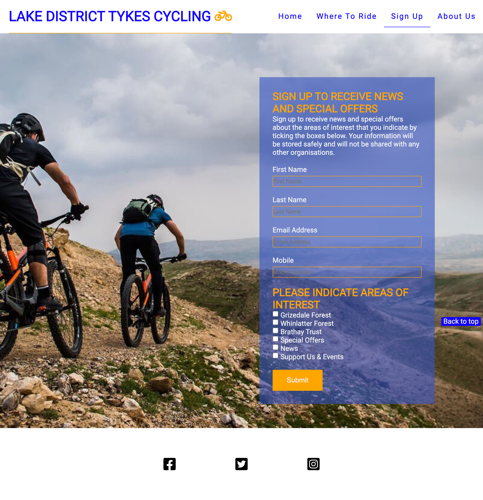

# Lake District Tykes Cycling

[View website in Github](url)

### Aim
The aim of this website is to guide potential clients to sign up to the events and newsletter while also provding comprehensive cycle routes for them to get active and explore the countryside with their famalies

## Description
This website is to provide a comprehensive list of cycling routes for families with children that are beginners to families with children that are advanced cyclists and ennd fun, safe cycling routes that meed their needs. The website features a promotional video for fun family events they can sign up to join, Sign up page, a page dedicated to cycling routes they can view sign up and download. The sites primary goal is to lead potential customers to sign up on the sign up page.

## Business Goals
* Excellent UX to keep visitors on the site long enough to fill out the sign up form
* Provide solutions for families to get active through cycling
## Client Goals
* Visitors are looking for comprehensive cycle route information for families with children
* Easy path to download there chosen cycle route

## Table of Contents

1. [UX](#ux)
* [Client Stories](#ux1)
* [Wireframe Mockups](#ux2)
2. [Features](#features)
3. [Bugs discovered](#bugs)
4. [Credits](#credits)
* Content
* Media
* Animations
* Code

## UX 

### The ideal client for this business is:

* English speaking
* Is a parent
* Lives in the Uk
* Interested in Cycling
* Interested in participating in scheduled events

### Visitors to this website are searching for

* Cycling routes for families with children of all ages abilities
* Fun family friendly activities to participate in

### This project is the best way to help them achieve this because:

* Most cycling websites have poor UX
* Most cycling websites have to much information which can oveerload the visitor
#### This website is:
* Easy to navigate
* guides the visitor through the information
* Gives the visitor the information they need 
* Guides the visitor to the goal of the website, sign up information.

## Client Stories 

1. As an new visitor to the website, I want to easily navigate the site so I can find what I want efficiently
2. As an new visitor to the website, I want to view the differnet routes in detail so I can decide which one to choose
3. As a new visitor to the website, I want to learn more about the people who have selected the cycling routes presented to make a connection
4. As a potential client, I want to know past clients reviews of the cycling routes on offer
As a potential client, I want to know how I can download the cycle routes
5. As a potential client, I want to understand the download process, so I know the next setps to take
6. As an interested observer and potential client, I want to be able to follow the events on social media so I can keep up to date with the latest news and events and sign up to up-coming events
7. As an interested client, I want an easy to fill in contact/ sign up form, so I can make contact sign up to activities
8. As a returning visitor to the website, who has already signed up/ provided contact details, I want to be able to leave a review of cycle routes and activities easily

## Wire frame mockups 

* [Wireframes.pdf](assets/wireframes/lake-district-cycling.pdf)

### Development Process 

---
## Features 

* Home Page
* Navigation bar
* The sites logo and navigation bar features on all four pages, and allows the user to navigate between pages. The layout is exactly the same and it is responsive to screen size it's viewed on.

* Back to top of page button
* There is a back to top of page button which is fixed to the screen at the bottom right to allow easy navigation on the page for the user. This is featured on all four pages.

* Landing page image
* The landing page image includes a photo of a family cycling in the Lake District and text overlay which lets the user understand what they will find on the site.

* Types of Rides section
* In this section the user can see the different level of rides which are available to chese from. Each level of ride has a picture and text to describe what to expect and a clickable link to take you straight to that section of the site.

* Our Partners and sign up link
* In this section the user will find information from our partners on related activities with clickable external links to their sites. The links will open in a new tab to make navigation easy. There is also a sign up button to navigate the user to our sign up page.
* There is an imbedded video from youtube from Brathay Trust which is responsive to screen size.

* The Footer social media links
* In this section the user will find clickable links to our social media platforms to encourage them to keep in touch. The links will open in a new tab to make navigation easy.

* Where To Ride Page
* On this page the user will find all the information they need to chose a cycle ride in the Lake District that suits the appropriate level they require, which has been split into Beginners, Intermediate and Advanced.
* Each level of rides has several choices to chose from with an image and supporting text. There is a clickable link to the sign up page in the supporting text to encourage the user to sign up for offers and information form our partners.
* All pictures and supporting text are responsive to work on all types of devices and screen sizes.

* Sign Up Page
* On this page the user will find information on why and how to sign up to receive news and special offers from our partners.

* Background image
* The background image shows cyclists on a trail with spectacular views to encourage the user to imagine themselves on the trail and to sign up.

* Sign Up Form
* The sign up form is floating to the right and the colours used for continuity throughout the site.
* Inputs are styled so the user knows when they are in a particular input with the label above and radio buttons so the user can select the information they would like to receive.
* The sign up button changes colour when the mouse hovers over it so the user is aware when the are on it. 

* About Us Page
* On this page the user will find information about the people who chose the rides they are going to choose from to allow them to make a connection.
* Images and text are responsive to change in screen size and will give the user information about the family and their interests.
* Video shows the little tykes cycling through a flooded path and will allow users to relate to

* Review Form
* The review form allows the user to submit a review of the rides on offer and or their experience of other rides for us to review and include in site upgrades.

---
## Bugs 

* When testing the responsiveness of the site a few bugs were found and corrected.
* The sign up button on the home page had used a button tag with an a element inside. The button element was replaced by a div and styled accordingly.
* the sign up form had to opening form tags. One tag was removed to correct.
The sign up form had two classes attached and this made the form display incorrectly. One class removed which resolved the issue.
* A spelling mistake was found in the css file on line 90 which was corrected.
---
## Credits 

### Content

### Media
#### The photos used on the home and sign up page are from Google Images and linked to original site:
* hero-image.jpeg - nationaltrust.org
* grizedale-trail-adv.jpeg - holidaycottagescumbria.com
* grizedale-map.jpeg - grizedalemountainbikes.co.uk
* grizedale-fam.jpeg - forestryengland.uk
* grizedale-trail.jpeg - forestryengland.uk
* whimlatter-fam.jpeg - moredirt.com
* whimlatter-int.jpeg - moredirt.com
* whimlatter-adv.jpeg - mbr.co.uk
* grasmere-fam.jpeg - letsride.co.uk

### Code
youtube - <iframe width="737" height="415" src="https://www.youtube.com/embed/F9dWj-lx8bQ" title="Brathay Adventures" allowfullscreen></iframe>